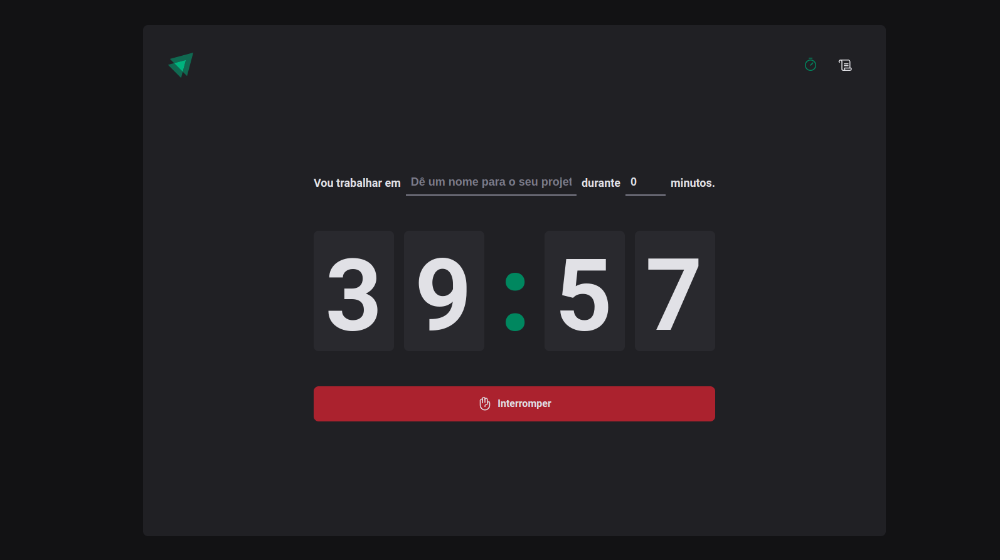
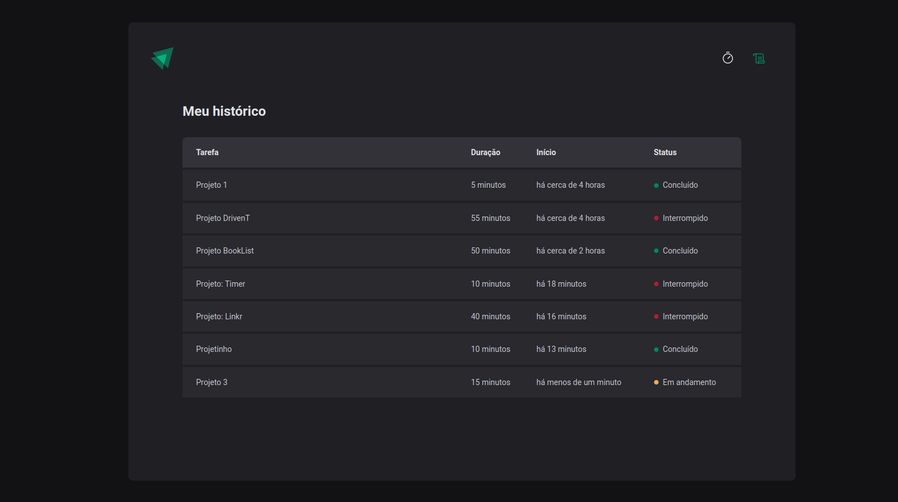

# Timer  

## Sobre

O timer é útil para fazer intervalos para estudo e trabalho
```
Ex: 40 min. de estudo
    20 min. de desanso
```
A pessoa digita o nome da tarefa que vai fazer, logo em seguida estabelece um tempo e clica em começar:
##

##

##

