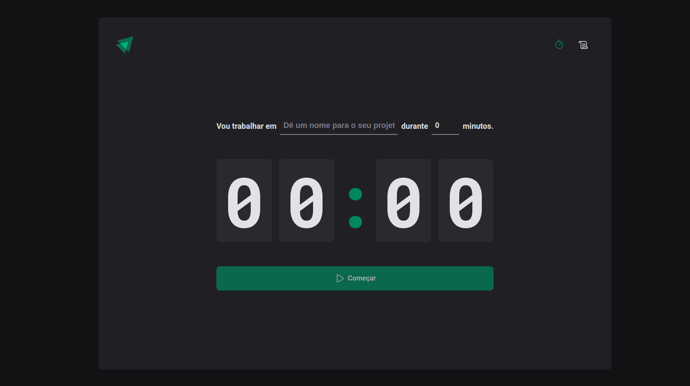

# Timer  

## Sobre

O timer é útil para fazer intervalos para estudo e trabalho
```
Ex: 40 min. de estudo
    20 min. de desanso
```
A pessoa digita o nome da tarefa que vai fazer, logo em seguida estabelece um tempo e clica em começar:


##
O timer pode ser interrompido quando quiser:


##

O usuário poderá ver todo o histórico dos ciclos que já realizou:


[](https://nodejs.org/en/)
[](https://expressjs.com/)
[](https://www.typescriptlang.org/)
